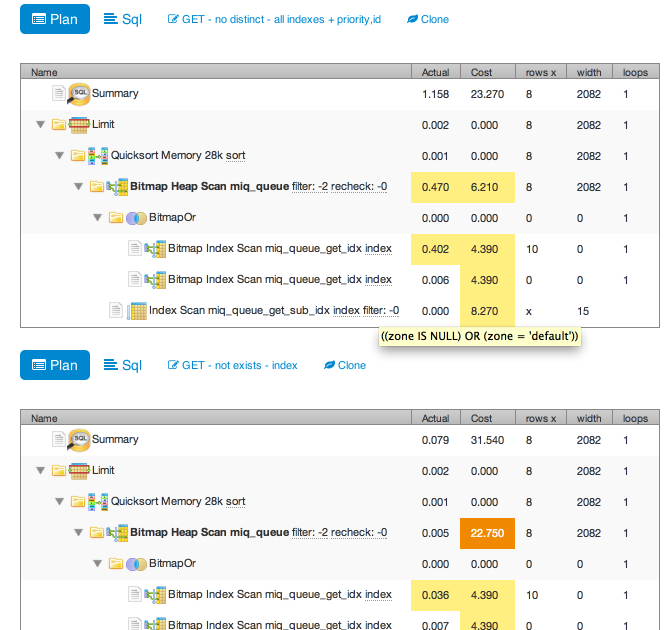

Rails app to view and compare postgres [explain plans][].
Thanks for great [inspiration][].

While researching how to [parse explain plans][], I found a great 2 part article [first][], [second][] with a fun graph and images from [pgadmin][].

Good [index information][] and want to get as much of that as possible into plan

[first]: http://www.postgresonline.com/journal/archives/174-pgexplain90formats_part1.html
[second]: http://www.postgresonline.com/journal/archives/174-pgexplain90formats_part2.html
[parse explain plans]: http://postgresql.1045698.n5.nabble.com/Parsing-output-of-EXPLAIN-command-in-PostgreSQL-td4981575.html
[pgadmin]: http://www.postgresql.org/ftp/pgadmin3/release/v1.18.1/src/
[explain plans]: http://www.postgresql.org/docs/9.3/static/using-explain.html
[inspiration]: http://explain.depesz.com/
[index information]: http://use-the-index-luke.com/sql/explain-plan/postgresql/operations

